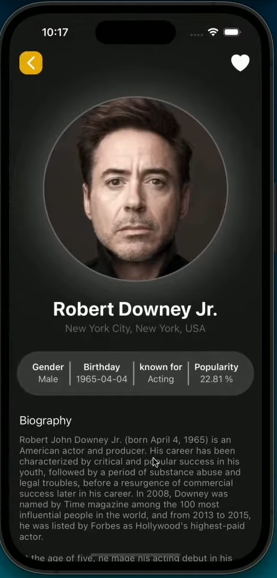
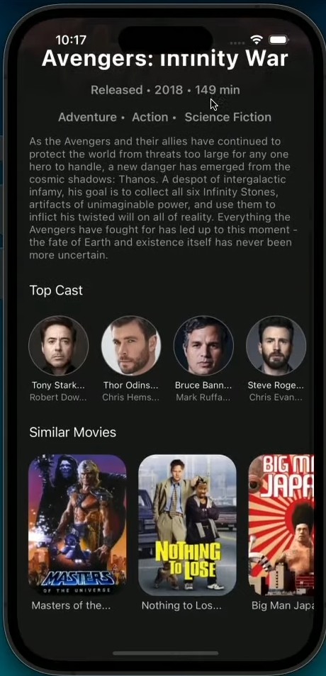
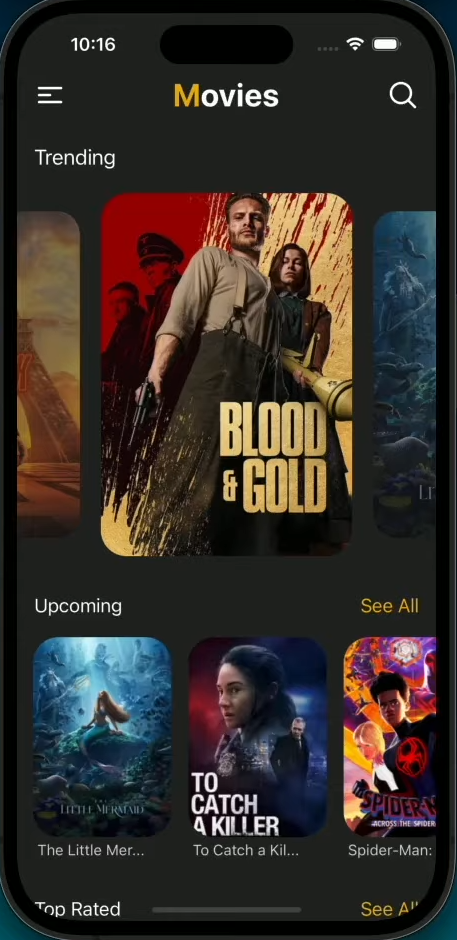
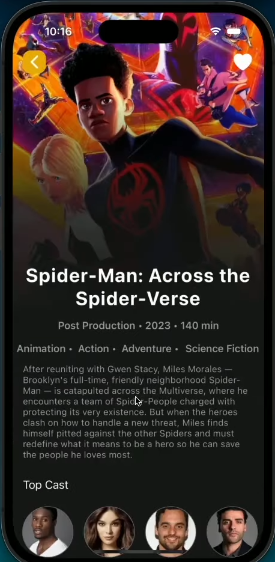
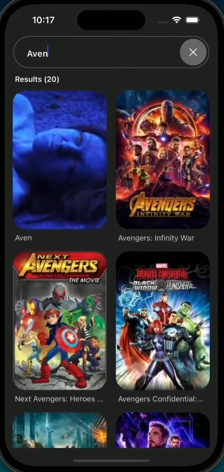

# 🎬 Movies App

A sleek and modern **React Native** mobile application that allows users to explore and search for movies, just like the **IMDb** app.

This app utilizes the [TMDB API](https://www.themoviedb.org/documentation/api) to fetch up-to-date movie information, including cast details, ratings, and more. Built using **Expo**, styled with **NativeWind** (Tailwind CSS for React Native), and structured with best practices for a smooth developer and user experience.

---

## ✨ Features

- 🔍 **Search** movies by title
- 🎭 **Browse** popular and trending movies
- 🎬 **Detailed movie pages** with cast, overview, and ratings
- 🎨 Beautiful and responsive **UI using Tailwind CSS**
- ⚡ Smooth navigation with **Expo Router**

---

## 📸 Screenshots

<p float="left">
  
  
  
  
  
</p>

---

## 🧰 Tech Stack

- **React Native** with [Expo](https://expo.dev/)
- **TMDB API** for movie data
- **NativeWind** (Tailwind CSS for RN)
- **Expo Router** for seamless navigation

---

## 🚀 Getting Started.

### 1. Clone the Repo
```bash
git clone https://github.com/your-username/movies-app.git
cd movies-app
npm install
npx expo start

## Made with ❤️ by Me
Feel free to open issues or contribute!
